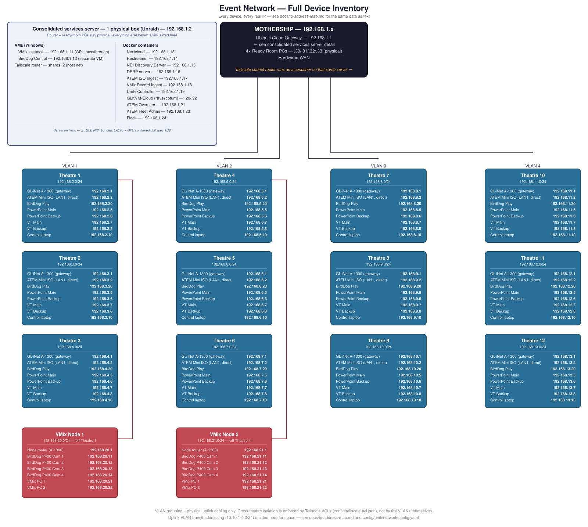
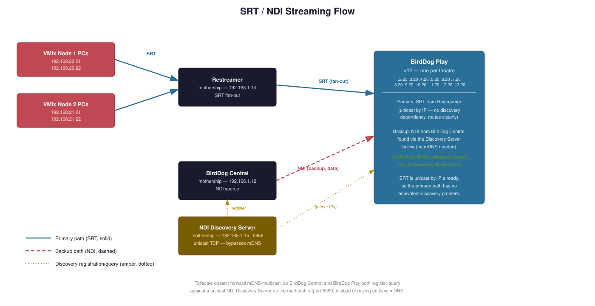
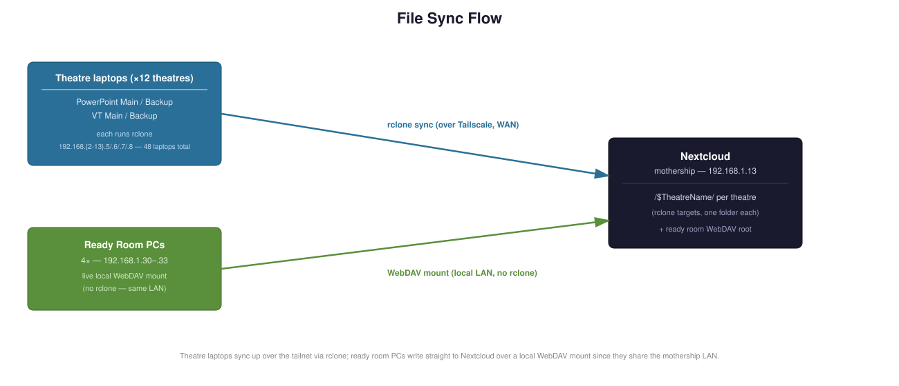

# Example Network Topology

A complete, fully-worked network design for a 12-theatre live event: every theatre
streams its program feed and syncs its files back to a central "mothership," all riding
over a single Tailscale mesh, with no reliance on venue Wi-Fi or a conference-provided
network.

**This is an anonymized reference design**, published as a worked example of the whole
process — topology, bandwidth modelling, hardware selection with rationale, generated
configs, deployment runbook. It's a real design for a real event, with the identifying
details generalized: all domains are placeholders on the IANA-reserved `example.net`
(substitute your own), and nothing here names the event, client, or venue. Product
names, prices, and throughput figures are real and cited.

**Status: design finalized, nothing built yet.** Every hardware decision is locked in,
every device has a real IP, throughput has been checked against real-world figures and the
venue's actual VLAN constraints, and Tailscale/GL-iNet/UniFi configs are generated and
ready to apply — see [`docs/open-questions.md`](docs/open-questions.md) for the handful of
things that still need real-world input before this goes from design to build, or
[`docs/deployment-runbook.md`](docs/deployment-runbook.md) for the full ordered build
sequence.

---

## The shape of it

12 theatres, each its own isolated subnet, connect back to one mothership over Tailscale.
Physical uplink cabling is grouped 3-theatres-per-VLAN purely for cable management — the
VLANs don't provide isolation themselves, **Tailscale ACLs do**: every theatre can reach
the mothership, but never another theatre, and never a VMix node. Two extra "VMix nodes"
hang off Theatre 1 and Theatre 4 respectively, each with its own cameras, its own router,
and its own place on the tailnet.

Every box in that diagram is a real device with a real address — 133 of them in total,
counting the live-editing suite's own four.
[`docs/ip-address-map.md`](docs/ip-address-map.md) has the same inventory as a plain text
table, if that's easier to search or paste from.

## Streaming: SRT primary, NDI backup

Each theatre's **BirdDog Play** receives the event's program feed two ways:

- **Primary — SRT**, unicast by IP from the mothership's Restreamer straight to each
  theatre's BirdDog Play. No discovery mechanism needed, so it's the more robust path —
  and it can originate directly from the ATEM's own built-in hardware streaming engine or
  from VMix, no computer required either way.
- **Backup — NDI**, from BirdDog Central. NDI normally discovers sources over local mDNS
  multicast, which Tailscale can't carry between theatres — so both ends instead register
  with a self-hosted **NDI Discovery Server**, a unicast-TCP service built into NDI 5+
  specifically for this WAN/VPN case. Confirmed working on BirdDog Play's own firmware
  (BirdUI's Network panel has a Discovery Server field built in).

**Why BirdDog Play at all, rather than a laptop running VLC?** Zero on-site config, native
dual-protocol support, broadcast-grade unattended reliability, and central management from
the mothership — [Flock](https://github.com/stoatworks-labs/flock) (a purpose-built fleet
manager for exactly this device) is the fleet-management tool, with per-unit BirdUI as
the fallback. BirdDog Central is retained too, but for a different job: it's the sender
side of the NDI backup path above, not a management requirement. Full comparison in
[`docs/birddog-play-rationale.md`](docs/birddog-play-rationale.md).

## File sync: rclone up, WebDAV local

Theatre laptops (PowerPoint and VT, main and backup — 48 across all 12 theatres) each run
`rclone`, syncing their theatre's folder up to Nextcloud over the tailnet. The mothership's
4 ready-room PCs skip rclone entirely and mount Nextcloud directly over local WebDAV, since
they already share its LAN.

## ATEM ISO ingest: near-real-time, no manual chunking

Each theatre's ATEM Mini Extreme ISO records up to 9 H.264 streams (8 camera ISOs +
program) to a USB SSD — and, unlike most of this design, there's no laptop involved: the
mothership pulls directly from the ATEM's **built-in FTP server** over Tailscale subnet
routing, transferring only the bytes appended since the last check. That matters because
the file is *constantly growing*: a naive whole-file re-sync on a schedule doesn't survive
the math for a real session (a 3-hour, 6-stream recording is 50-80GB — re-uploading that
*whole thing* every 10 minutes takes longer than 10 minutes, falling permanently behind).
Two documented ways to get that incremental transfer: FTP's own `REST`/resume command
directly (the default — plain rsync can't be used for this leg, since it needs SSH or an
rsync daemon and the ATEM only speaks FTP), or `rclone mount` (presenting the ATEM's FTP
share as a local path) paired with `rsync --append`, which transfers only the new tail
without needing rsync's usual full-file checksum pass. Either way, the pull writes straight
into the folder Nextcloud has mounted as External Storage, so there's no second upload step
and no need to slice the video file itself — full design in
[`docs/atem-iso-ingest.md`](docs/atem-iso-ingest.md).

## VMix record ingest: same mechanism, a Windows SMB share instead

The 4 VMix PCs (2 per node) get the same treatment, just retargeted at a Windows SMB
share instead of an FTP server — SMB is a genuine network filesystem protocol, so mounting
it is the native way to access it here, if anything a better fit than the ATEM's FTP-only
case rather than a stretch of the same pattern. `rclone mount` presents each PC's share as
a local path, and `rsync --append` transfers only the new tail, same reasoning as the ATEM
ingest's alternative approach. Each VMix node has its own dedicated A-1300 uplink — not
shared with the theatre it physically sits near — so this traffic never competes with that
theatre's ATEM ingest or SRT feed. Full design in
[`docs/vmix-record-ingest.md`](docs/vmix-record-ingest.md).

## Self-hosted admin tooling: UniFi Controller + GLKVM-Cloud

Two self-hosted services on the consolidated server, both following the same rule the
rest of this design does — no dependency on a vendor's own cloud for managing this
design's own infrastructure:

- **UniFi Controller** (self-hosted UniFi Network Application) gives a local, independent
  management console for the Cloud Gateway, separate from relying on `cloud.ui.com` — the
  Cloud Gateway ships with its own built-in controller and works fine without this, so
  it's optional, but not depending on a vendor cloud to administer the mothership's own
  router fits the pattern everything else here follows.
- **GLKVM-Cloud** gives centralized, browser-based SSH terminal and web-admin proxy access
  to all 14 GL-iNet routers at once, instead of 14 separate sessions — using GLKVM-Cloud's
  documented support for embedded OpenWrt devices, not its flagship KVM-hardware feature
  set (there's no physical KVM unit anywhere in this design). Full design, including a
  real WAN-port-forward collision this surfaced with the DERP server and how it was
  resolved, in [`docs/glkvm-cloud.md`](docs/glkvm-cloud.md).

## Fleet management: ATEM Overseer + Fleet Admin, and Flock

Three more mothership services, this time for the theatre hardware itself rather than the
network infrastructure — all separate projects
([`atem-overseer`](https://github.com/stoatworks-labs/atem-overseer),
[`atem-fleet-admin`](https://github.com/stoatworks-labs/atem-fleet-admin),
[`flock`](https://github.com/stoatworks-labs/flock)), not built from source in this repo:

- **ATEM Overseer** is a fleet-wide monitoring/tally dashboard — every theatre's ATEM
  sends it a dedicated low-bitrate monitoring stream (10 Mbps, folded into the bandwidth
  model below), giving one central multiview view of all 12 theatres instead of walking
  to each one.
- **ATEM Fleet Admin** provisions many ATEMs at once from model-aware config forms,
  either pushed live over the network (reaching all 12 theatres the same way ATEM ISO
  Ingest does — Tailscale subnet routing, no separate path needed) or exported as
  loadable XML + a media folder.
- **Flock** does the same fleet-manager job as ATEM Fleet Admin, but for the 12 theatres'
  BirdDog Play units — LAN discovery, tag-based grouping, BirdUI-parity settings, batch
  edits. Each BirdDog Play also sends Flock its own 10 Mbps SRT preview stream, same
  treatment as Overseer's — also folded into the bandwidth model below.

## Bandwidth: real numbers, right-sized VLANs

The 4 uplink VLANs turned out to be **venue-supplied, not our infrastructure** — 1 Gbps
each, with expensive ports, which flips the goal from "isolate cleanly" to "minimum VLAN
count at adequate performance." The full model, grounded in real figures (SRT ~5.8-10.4
Mbps via long-GOP H.264 + SRT/WireGuard overhead, ATEM ISO ingest ~62-94 Mbps plus the
ATEM Overseer and Flock monitoring/preview streams — ~10.4 Mbps apiece — together
dominating per-theatre upstream, full NDI at 1080p50 a very different ~130 Mbps roughly
regardless of content), is in
[`docs/bandwidth-analysis.md`](docs/bandwidth-analysis.md). Headlines:

- The current 4-VLAN plan runs at 27-39% utilization under normal operation — still
  comfortable, though real-time ATEM ingest plus both monitoring streams have eaten a
  genuine chunk of what used to be a much wider margin.
- **Consolidating to 2 VLANs** is still workable but has real eroded margin (53-78%,
  down from 41-65% before either monitoring stream existed) for normal SRT-primary
  operation — worth actively re-weighing now, not just noting. A **mass NDI fallback**
  (e.g. a Restreamer failure pushing all 12 theatres onto NDI at once) pushes 2 VLANs to
  90% with no room left; 3-4 VLANs stay comfortable through that same event.
- **1 VLAN no longer works with real-time ATEM ingest, full stop** — it now exceeds
  capacity under normal expected load (106%), not just an unlucky worst-case day.
  Deferring ATEM ingest to end-of-session pulls (rather than real-time) is required to
  make 1 VLAN viable at all, not just a nice-to-have lever anymore.
- **A separate, previously-missed finding**: each theatre's own A-1300 has a tighter
  ceiling (~170 Mbps) than the shared VLAN — a theatre running ATEM ingest and an NDI
  fallback simultaneously can exceed *its own router's* capacity regardless of VLAN count.
  Mitigation: pause that theatre's ATEM ingest during an NDI fallback (cheap, config-only)
  — still works with both monitoring streams added, but with less spare margin than before.
  A higher-throughput GL-iNet model would also fix it, but not cleanly — see the doc for
  why.

## Why Tailscale avoids DERP relay here

Every device in this design — all 12 theatres, both VMix nodes, the mothership — sits
behind the *same* shared venue internet connection. That's an unusually favorable setup
for Tailscale: direct connections are likely either over the true private LAN path or via
a NAT hairpin through that one shared public IP, with public DERP relay only as a last
resort. As extra insurance, a self-hosted DERP server (reachable at
`derp.example.net:443`) runs on the mothership itself, so even relayed traffic never
actually leaves the venue. Full reasoning in [`docs/tailscale.md`](docs/tailscale.md).

## Hardware, confirmed

| Role | Hardware | Why |
|---|---|---|
| Mothership router | Ubiquiti **Cloud Gateway** | Can't run Tailscale natively — that role moves to a container on the services server instead |
| Consolidated services server | **Unraid**, single physical box (already on hand) | Hosts BirdDog Central as the design's only Windows VM (no GPU passthrough anywhere — the mothership VMix VM was removed, its role never established; theatre program feeds originate from the VMix node PCs), plus Nextcloud/Restreamer/NDI Discovery Server/DERP/ATEM ISO Ingest/VMix Record Ingest/UniFi Controller/GLKVM-Cloud/ATEM Overseer/ATEM Fleet Admin/Flock as Docker containers. Chosen over TrueNAS SCALE for its polished container UX (Community Applications). Calculated target spec (storage pools, RAM, CPU, NIC validation — no GPU required) in [`docs/server-specification.md`](docs/server-specification.md) |
| Theatre + VMix node routers | GL-iNet **A-1300** (Slate Plus) ×14 | 12 theatre routers + both VMix node routers, same model throughout. ~170 Mbps WireGuard, comfortable headroom for normal operation (~55% combined); 2 LAN ports let the ATEM Mini Extreme ISO sit on its own dedicated port, away from the rest of the room's traffic — it carries the heaviest sustained load (near-real-time ISO ingest). Its own ceiling is the tighter constraint during an NDI fallback though (128% combined with ATEM ingest, resolved by pausing that theatre's ingest during the fallback) — margin worth watching if any further theatre-to-mothership stream ever gets added, see [`docs/bandwidth-analysis.md`](docs/bandwidth-analysis.md). Full case for GL-iNet + Tailscale specifically — segmentation, multi-WAN, pay-per-device WiFi economics, other uses beyond this event, and the same ceiling reasoning — in [`docs/gl-inet-rationale.md`](docs/gl-inet-rationale.md) |
| Theatre playback | **BirdDog Play** ×12 | Zero-config, native SRT+NDI, centrally fleet-managed — see above |
| Server NICs | **Bonded**, 802.3ad/LACP | SRT bandwidth isn't constant — LACP spreads the many simultaneous flows this box handles (12 theatres' SRT fan-out, rclone, Nextcloud, DERP) across both links for real aggregate headroom |

See [`docs/open-questions.md`](docs/open-questions.md) for the reasoning behind every one
of these, including the couple of things assumed rather than confirmed (and the fallback
if an assumption turns out wrong).

## Live editing: a separate subsystem, not the theatre network

2× MacBook Pro editing workstations plus dedicated fast storage at the mothership,
editing event content as it arrives rather than waiting until after the event —
deliberately on its **own dedicated 10GbE LAN** (`192.168.22.x`), not part of the
Tailscale mesh or the theatre-facing network the rest of this repo is sized for.
Editing needs sustained multi-gigabit throughput per editor; putting that on the
existing bonded 1GbE would either starve the editors or risk contention with the live
ingest pipelines still running during the event.

Key decisions, each evaluated rather than assumed:

- **Dedicated NAS, not Nextcloud's own storage** — the same rclone/rsync pull that
  ingests each theatre's ATEM/VMix footage into Nextcloud writes a second copy straight
  to the edit-suite NAS at the same time, no chained re-sync. Decouples editing entirely
  from the live show's infrastructure.
- **A dedicated Mac mini running both the Resolve Project Server and Remote Render** —
  needed because the whole workflow below is one shared show project both editors work
  against, not two independent copies (confirmed **not** possible on a Blackmagic Cloud
  Store appliance itself, which is storage-only). Combining both roles on one box isn't
  documented as forbidden by Blackmagic but is thinly precedented in practice — see
  Decision 2 in [`docs/live-editing.md`](docs/live-editing.md) for the full honesty-check.
- **Blackmagic Cloud's internet sync service — not needed here.** A genuinely separate
  product from the Cloud Store hardware, built for cross-site collaboration; this is a
  single-venue setup with no second site to sync with.
- **A pre-built Resolve project structure, generated by
  [resolve-configurator](https://github.com/stoatworks-labs/resolve-configurator)** — a
  companion project to this design — scaffolds a bin per theatre-day and an empty
  timeline per session ahead of time, plus writes the exact smart-bin rules as a
  one-time-apply recipe (Resolve's own scripting API can't create real smart bins). Once
  footage lands on the NAS and that recipe's been applied, each session's bin auto-fills
  with just its own clips — editors open a session, drag in, top-and-tail, export.

Also covers a complementary DIT (Digital Imaging Technician) ingest workflow for
physical media — the ATEM's own USB SSD and any standalone camera cards — comparing
ShotPut Pro, OffShoot, Silverstack, and the companion tools FoolCat (camera reports) and
o/PARASHOOT (safe card reformatting). Full design in
[`docs/live-editing.md`](docs/live-editing.md).

## Subnet map

Mothership on `192.168.1.x`; theatres contiguous from `.2.x` through `.13.x`, grouped 3
per physical VLAN purely for uplink cabling.

| Theatre | Subnet | VLAN (uplink grouping) |
|---|---|---|
| 1 | 192.168.2.x | VLAN 1 |
| 2 | 192.168.3.x | VLAN 1 |
| 3 | 192.168.4.x | VLAN 1 |
| 4 | 192.168.5.x | VLAN 2 |
| 5 | 192.168.6.x | VLAN 2 |
| 6 | 192.168.7.x | VLAN 2 |
| 7 | 192.168.8.x | VLAN 3 |
| 8 | 192.168.9.x | VLAN 3 |
| 9 | 192.168.10.x | VLAN 3 |
| 10 | 192.168.11.x | VLAN 4 |
| 11 | 192.168.12.x | VLAN 4 |
| 12 | 192.168.13.x | VLAN 4 |

VMix Node 1 (off Theatre 1): `192.168.20.x`. VMix Node 2 (off Theatre 4): `192.168.21.x`.
See [`docs/bandwidth-analysis.md`](docs/bandwidth-analysis.md) for whether this 4-VLAN
grouping is the right count to actually build, or whether to consolidate.

## Operations: building it, running it, and the road not taken

Three docs turn the design into something an on-site crew can actually execute:

- [`docs/deployment-runbook.md`](docs/deployment-runbook.md) — the full ordered build
  sequence, Phase 0 (confirmations) through Phase 7 (pre-event verification), each step
  linking back to the doc with the detail. This is the doc to have open on build day.
- [`docs/troubleshooting.md`](docs/troubleshooting.md) — the gotchas surfaced *during
  design* (unreachable theatres, DERP relay when direct was expected, NIC bonds that
  won't form, ingest falling behind, missing monitoring previews), each as
  symptom → cause → fix, so they don't have to be rediscovered under show pressure.
- [`docs/topology-alternative-tailscale-switches.md`](docs/topology-alternative-tailscale-switches.md)
  — the road not taken: plain switches + Tailscale on generic Linux boxes instead of
  GL-iNet routers. Documented with working configs
  ([`config/alt-tailscale-switch/`](config/alt-tailscale-switch/)) so the decision can be
  revisited with evidence, but not recommended — the doc explains why.

## Before build — open items

Design is finalized; these are the headline items still needing real-world input before the config in this repo gets applied (the complete list, including a few smaller ones, lives in [`docs/open-questions.md`](docs/open-questions.md); the ordered build sequence is [`docs/deployment-runbook.md`](docs/deployment-runbook.md)).

- [ ] Check the existing consolidated services server against the calculated target spec in [`docs/server-specification.md`](docs/server-specification.md) (CPU/RAM headroom, storage pool layout — no GPU requirement any more).
- [ ] Add the `derp.example.net` DNS record for the self-hosted DERP server.
- [ ] Verify the DERP hairpin isn't caught by the uplink-VLAN firewall block before relying on it.
- [ ] Confirm the real ATEM ISO bitrate/active-channel count and empirically verify partial-file playability.
- [ ] Confirm what VMix is actually recording and set up real SMB shares/credentials on all 4 VMix PCs.
- [ ] Confirm the final VLAN count with the venue, and decide whether a mass-NDI-fallback event needs to survive at full quality (drives 3-4 vs. 2 VLANs) — [`docs/bandwidth-analysis.md`](docs/bandwidth-analysis.md).
- [ ] Add the `kvm.example.net` DNS record and confirm `GLKVM_ACCESS_IP`'s exact format for the WAN-remapped GLKVM-Cloud ports — [`docs/glkvm-cloud.md`](docs/glkvm-cloud.md).
- [ ] Confirm ATEM Overseer's, ATEM Fleet Admin's, and Flock's real container images, and whether the ATEM/BirdDog Play can actually originate their monitoring/preview streams alongside their primary feeds — [`docs/open-questions.md`](docs/open-questions.md) #11.
- [ ] Implement the second write destination (the edit-suite NAS) in the actual ingest scripts — documented in [`docs/live-editing.md`](docs/live-editing.md) but not yet a code change — [`docs/open-questions.md`](docs/open-questions.md) #15.
- [ ] Verify the NDI backup path's settled redistribution model — VMix node NDI → BirdDog Central → theatre PLAYs (Restreamer can't emit NDI and Central can't ingest SRT, both confirmed) — including that Central genuinely re-originates the stream rather than pointing receivers at the source — [`docs/streaming-flow.md`](docs/streaming-flow.md), [`docs/open-questions.md`](docs/open-questions.md) #16.
- [ ] Decide how much footage the live-editing subsystem needs access to, confirm the Mac mini's combined Project Server + Remote Render role holds up under real load, and whether any standalone cameras are in scope — [`docs/live-editing.md`](docs/live-editing.md), [`docs/open-questions.md`](docs/open-questions.md) #12-14.

## Everything in this repo

**Design docs**
- [`docs/topology.md`](docs/topology.md) — full network layout: subnets, VLAN grouping, mothership, VMix nodes, theatre wiring
- [`docs/server-specification.md`](docs/server-specification.md) — calculated minimum spec for the consolidated server (storage pools, RAM, CPU, NIC validation; GPU no longer required)
- [`docs/ip-address-map.md`](docs/ip-address-map.md) — every device on the network, with its real IP (133 devices, including the live-editing subsystem's NAS, 2 MacBook Pros, and Project Server/Remote Render Mac mini)
- [`docs/streaming-flow.md`](docs/streaming-flow.md) — SRT/NDI streaming path, the NDI Discovery Server plan
- [`docs/birddog-play-rationale.md`](docs/birddog-play-rationale.md) — why BirdDog Play over a laptop + VLC for theatre playback
- [`docs/gl-inet-rationale.md`](docs/gl-inet-rationale.md) — why GL-iNet + Tailscale for segmentation/routing, multi-WAN/pay-per-device WiFi economics, and other uses (LED processors, mixing desks, mesh) beyond this event
- [`docs/live-editing.md`](docs/live-editing.md) — post-production subsystem at the mothership: dedicated NAS/network, Resolve collaboration decisions, the resolve-configurator-driven edit workflow, DIT ingest tool comparison
- [`docs/file-sync-flow.md`](docs/file-sync-flow.md) — rclone + WebDAV sync to Nextcloud
- [`docs/atem-iso-ingest.md`](docs/atem-iso-ingest.md) — near-real-time ATEM ISO ingest into Nextcloud, no manual chunking
- [`docs/vmix-record-ingest.md`](docs/vmix-record-ingest.md) — same mechanism, targeting each VMix PC's SMB share
- [`docs/glkvm-cloud.md`](docs/glkvm-cloud.md) — self-hosted GLKVM-Cloud for centralized remote administration of the 14 GL-iNet routers
- [`docs/bandwidth-analysis.md`](docs/bandwidth-analysis.md) — real-world throughput math against the venue's 1 Gbps VLANs, and how many are actually needed
- [`docs/tailscale.md`](docs/tailscale.md) — DERP-avoidance reasoning, the self-hosted DERP server, verification commands
- [`docs/open-questions.md`](docs/open-questions.md) — every decision made, how it was reached, and what's still genuinely open
- [`docs/topology-alternative-tailscale-switches.md`](docs/topology-alternative-tailscale-switches.md) — plain switch + Tailscale-on-Linux alternative to GL-iNet, not recommended but documented
- [`docs/deployment-runbook.md`](docs/deployment-runbook.md) — ordered build checklist synthesizing every doc/config into one sequence
- [`docs/troubleshooting.md`](docs/troubleshooting.md) — known gotchas surfaced during design, symptom → cause → fix

**Diagrams** ([`diagrams/`](diagrams/)) — topology (full device inventory), streaming-flow, file-sync-flow, live-editing-dataflow (dual-write into the edit suite), and live-editing-project-structure (resolve-configurator → smart-bin recipe → editor workflow), all as standalone SVGs

**Offline exports** ([`export/`](export/)) — every doc as a self-contained HTML file and an A4 PDF, plus a combined `full-documentation` version of each — see [`export/README.md`](export/README.md)

**Generated configs**
- [`config/docker-compose.yml`](config/docker-compose.yml) — the entire consolidated server's Docker stack in one file, see [`config/README.md`](config/README.md)
- [`config/tailscale-acl.json`](config/tailscale-acl.json) — ACL policy (cross-theatre isolation) + the self-hosted DERP region
- [`config/tailscale-up-commands.sh`](config/tailscale-up-commands.sh) — per-role `tailscale up` template
- [`config/tailscale-up-all-devices.sh`](config/tailscale-up-all-devices.sh) — the same, fully instantiated for all 15 tailnet nodes
- [`config/gl-inet/`](config/gl-inet/) — UCI network config for all 14 routers (12 theatres + 2 VMix nodes), generated from templates
- [`config/unifi/`](config/unifi/) — Cloud Gateway VLAN/DHCP/firewall/port-forward reference
- [`config/atem-iso-ingest/`](config/atem-iso-ingest/) — the FTP-pull ingest script (and rclone+rsync alternative) plus Nextcloud External Storage setup
- [`config/vmix-record-ingest/`](config/vmix-record-ingest/) — the same rclone+rsync combo, targeting each VMix PC's SMB share
- [`config/glkvm-cloud/`](config/glkvm-cloud/) — the self-hosted GLKVM-Cloud docker-compose stack (`rttys` + `coturn`)
- [`config/alt-tailscale-switch/`](config/alt-tailscale-switch/) — configs for the plain-switch/generic-Linux alternative, not recommended but documented

## Trademarks

**NDI® is a registered trademark of Vizrt NDI AB.** See <https://ndi.video>.
Other product and company names mentioned in this documentation are the
trademarks of their respective owners. This project is not affiliated with or
endorsed by any of them.
